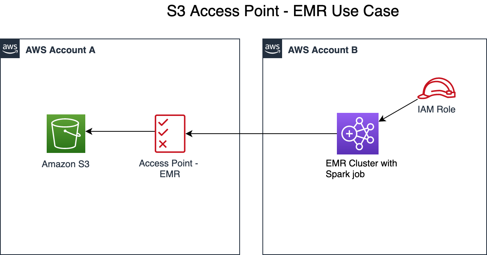

# Amazon S3 access points for cross-account integration - EMR use case

This is a sample solution to demonstrate S3 cross-account access from EMR using [Access points](https://docs.aws.amazon.com/AmazonS3/latest/dev/access-points.html). 

Figure below represents the architecture of the solution.



---

## AWS Service Requirements

The following AWS services are required to test this solution.

### Source Account

1. One Amazon S3 bucket
1. One bucket policy
1. One Access Point
1. One KMS Key to encrypt S3 bucket

---

### Target Account

1. One S3 Bucket
1. One IAM Role
1. One EMR Cluster

---

## Source Code Overview

| Code | Overview|
|-------------------------------------------------------------- | -------------- |
| [spark_on_emr_s3_access_points.py](./src/spark_on_emr_s3_access_points.py) | PySpark script to read and write data using S3 Access Points.|

---

## Deployment Instructions - Account A (E.g. 2345678901)

1. Login to AWS Management Console.
1. Go to KMS and create a Customer managed key
   - For Key administrators, add required users / roles in Account A
   - For Key users, add
      - required users / roles in Account A
      - under ```Other AWS accounts```, add id for Account B e.g. ```arn:aws:iam::123456790:root```
1. Go to S3 and create a bucket. Copy sample CSV data to this bucket. e.g. [NYC taxi data](https://registry.opendata.aws/nyc-tlc-trip-records-pds/)
1. Go to Properties, under Default encryption, select AWS-KMS and select the KMS key created in the previous step.
1. Create a bucket policy using sample [bucket_policy_delegate_permissions_to_access_point_sample](./resources/bucket_policy_delegate_permissions_to_access_point_sample.json)
1. Create access point using sample   [access_point_for_emr_role_sample](./resources/access_point_policy_for_emr_role_sample.json)


---

## Deployment Instructions - Account B (E.g. 123456790)

1. Go to S3 and create a bucket to store PySpark script and EMR logs
1. Go to EMR and click on `Create Cluster`
1. Under General Configuration, provide Name, S3 folder for logging and select `Cluster` as Launch mode
1. Under Software Configuration, select `emr-5.XX.X` as Release and `Spark` as Application
1. Under Hardware Configuration, select `m5.xlarge` as Instance type and `3` as number of instances
1. Under Security and access, create and select EC2 key pair, and permissions as default. For roles, select `EMR_DefaultRole` as EMR role and `EMR_EC2_DefaultRole` as EC2 instance profile
1. Click on "Create Cluster"
1. Once the EMR cluster is up and running, go to IAM and select `EMR_EC2_DefaultRole`
1. Attach two more policies to this role:
   - IAM Policy for KMS. Use [kms_policy_emr_sample](./resources/kms_policy_emr_sample.json) as a sample
   - IAM Policy for S3. Use [s3_policy_emr_sample](./resources/s3_policy_emr_sample.json) as a sample

---

## Testing Instructions - Account B

Follow below instructions to execute a PySpark job in EMR:

1. Upload the source code `s3_access_points.py` to S3 bucket created in Account B
1. Go to EMR console and select the cluster created in the previous step
1. Navigate to `Steps` tab and click `Add step`
1. Select `Spark Application` as Step type and provide a Name
1. Select `Cluster` as Deploy mode, S3 path for source code `s3_access_points.py` as Application location
1. Under Arguments provide the following:
   - --input_uri s3://arn:aws:s3::Account_A:accesspoint/a-emr-access-point/SAMPLE_CSV_FILE
   - --output_uri s3://arn:aws:s3::Account_A:accesspoint/a-emr-access-point/output
1. Select `Continue` as Action on failure and then click `Add`
1. This kick starts the Spark job. You can monitor the logs under Cluster > Application user interfaces > Spark history server
1. Once done, the step changes from `Pending` to `Completed` state.
1. Verify the output folder of S3 bucket in Account_A to make sure the data is saved.

---

## Cleaning up

TBA

---

## License Summary

This sample code is made available under the MIT license. See the LICENSE file.